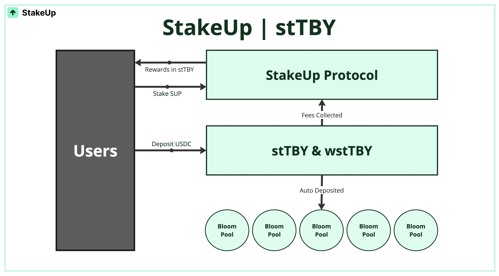
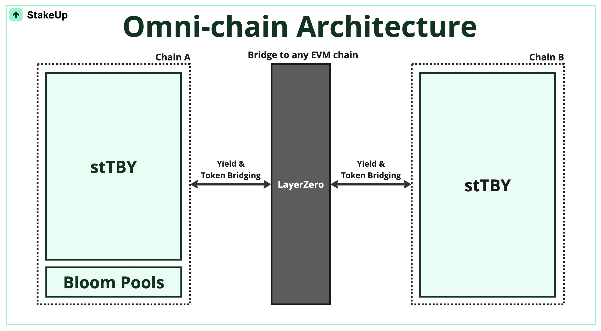

# Staked TBY (stTBY)

## Repo Setup

This repository uses Foundry as the main development and testing environment and Wake for testing cross-chain functionality, as well as verifying arithmetic accuracy of the contracts. Due to the lack of support for Wake in the current version of Foundry it is recommended to follow the steps below to setup the repository correctly.

1. Setup a virtual environment for the repository

```bash
python3 -m venv venv
```

2. Activate the virtual environment

```bash
source venv/bin/activate
```

3. Install the dependencies

```bash
pip install -r requirements.txt
```

After this your environment should be setup correctly. You should be able to run `wake` and `foundry` commands without any issues. It is recommended to use the custom bash script to compile contracts so that all wake files are updated correctly. For testing users can use the standard commands for the respective frameworks to run individual tests. If you want to run all the tests at once you must use the custom bash script.

Custom bash script for compiling contracts:

```bash
bash compile.sh
```

Custom bash script for running all tests:

```bash
bash test.sh
```

## Overview

stTBY is an omnichain stablecoin backed by receipt tokens called TBYs. TBYs, a product of Bloom Protocol, are a corporate debt token denominated in USDC and are over-collateralized with Backed Finances ib01 tracker certificate.

TBYs are limited due to users being subject to the 6-month fixed term lockup of the asset and that new TBYs are minted every two weeks as a different ERC-20, thus making it difficult to integrate into DeFi protocols.

## How stTBY Solves This Problem

stTBY solves TBYs composability issues by allowing users to deposit their TBYs or USDC into the contract and receive stTBY in return. stTBY can be thought of as an index of active TBYs in the market. As new Bloom Pool mint occur every two weeks, the stTBY contract will automatically redeposit all underlying funds into the new TBYs, allowing users to hold stTBY without the need of actively managing their various TBY batches. This token follows a rebasing mechanism that automates TBY's to stTBY holders.

## Design





### Tokens

- **stTBY**: The stTBY token is the main token of the protocol. It is a rebasing token that tracks the underlying TBY. It is minted when users deposit TBYs or USDC into the contract and burned when users withdraw their USDC. This token rebases using a hybrid system. Maintenance rebases occur every transaction, while yield rebases are triggered every 24-hours, via cross-referencing Bloom's `ExchangeRateRegistry` contract.

- **wstTBY**: Wrapped stTBY is the wrapped asset of `stTBY`. It is non-rebasing, allowing users to access the underlying value of their stTBY and be more useable in DeFi.

- **StakupToken**: StakeUp Token (SUP), is the reward token of the StakeUp Protocol.

- **SUPVesting**: SUPVesting is a vesting contract that locks up SUP tokens during predefined vesting schedules. Its purpose is to manage the distribution of SUP tokens to contributors and investors of the StakeUp Protocol and stTBY. These tokens are considered staked on the StakeUp Protocol and allow users to generate rewards even while locked under vesting schedules.

- **RedemptionNFT**: RedemptionNFT is a semi-fungible token minted to users when they redeem their stTBY in preparation for withdrawing their USDC from the contract. This system is similar to Lido's stETH withdrawal system but without a queue, or off-chain oracles.

### Staking

- **StakeUpStaking**: StakeUp Staking is the heart of the reward system for stTBY. It allows users to stake their SUP to access the reward system of the protocol. `stTBY` from fees are sent to the contract and is used to generate yield for the users of the protocol. Additionally it manage the distribution of SUP tokens to contributors and investors of the StakeUp Protocol and stTBY. These tokens are considered staked on the StakeUp Protocol and allow users to generate rewards even while locked under vesting schedules. 

Below is the outline of the fee mechanism of stTBY.

  - Mint Fees: .01%
  - Redeem Fees: .5%
  - Performance Fees: 10% of TBY yield

### Rewards

- **CurveGaugeDistributor**: The `CurveGaugeDistributor`, a feature of the `RewardManger` deploys CurveGauges and sends weekly emissions to the rewards gauges that are distributed to liquidity provider in the form of swap fees. Below is an outline of the liquidity pools eligible for rewards.

  - stTBY/3CRV
  - wstTBY/wstETH
  - wstTBY/CHAI
  - stTBY/SUP

### LayerZero Messaging
- **StakeUpMessenger**: The `StakeUpMessenger` is a contract that manages the messaging that allows stTBY to accrue yield equally on all chains. This occurs by batch sending messages from the base chain to all peer chains, updating `_globalShares` and `_totalUsd`.