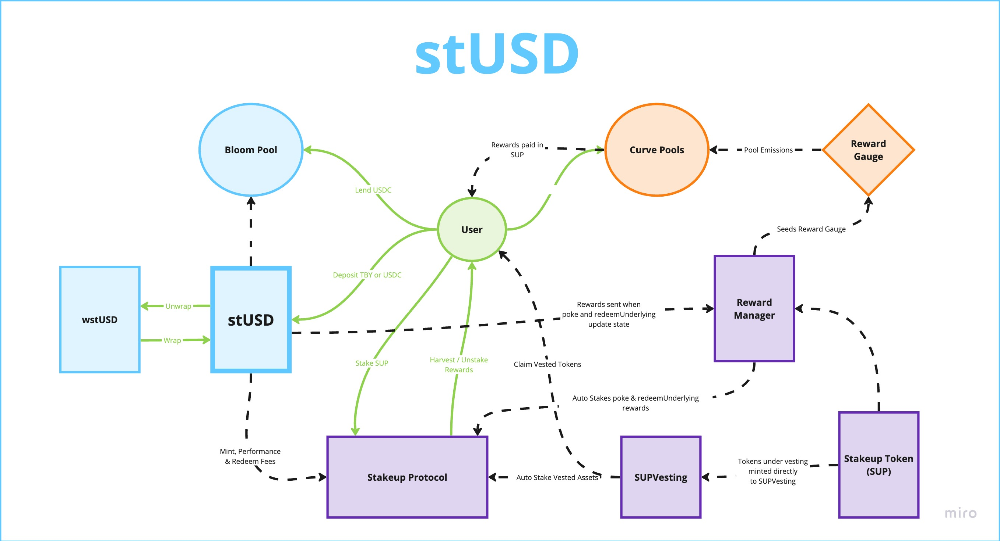

# Staked USD (stUSD)

## Repo Setup

This repository uses Foundry as the main development and testing environment and Wake for testing cross-chain functionality, as well as verifying arithmetic accuracy of the contracts. Due to the lack of support for Wake in the current version of Foundry it is recommended to follow the steps below to setup the repository correctly.

1. Setup a virtual environment for the repository

```bash
python3 -m venv venv
```

2. Activate the virtual environment

```bash
source venv/bin/activate
```

3. Install the dependencies

```bash
pip install -r requirements.txt
```

After this your environment should be setup correctly. You should be able to run `wake` and `foundry` commands without any issues. It is recommended to use the custom bash script to compile contracts so that all wake files are updated correctly. For testing users can use the standard commands for the respective frameworks to run individual tests. If you want to run all the tests at once you must use the custom bash script.

Custom bash script for compiling contracts:

```bash
bash compile.sh
```

Custom bash script for running all tests:

```bash
bash test.sh
```

## Overview

stUSD is an omnichain stablecoin backed by receipt tokens called TBYs. TBYs, a product of Bloom Protocol, are a corporate debt token denominated in USDC and are over-collateralized with Backed Finances ib01 tracker certificate.

TBYs are limited due to users being subject to the 6-month fixed term lockup of the asset and that new TBYs are minted every two weeks as a different ERC-20, thus making it difficult to integrate into DeFi protocols.

## How stUSD Solves This Problem

stUSD solves TBYs composability issues by allowing users to deposit their TBYs or USDC into the contract and receive stUSD in return. stUSD can be thought of as an index of active TBYs in the market. As new Bloom Pool mint occur every two weeks, the stUSD contract will automatically redeposit all underlying funds into the new TBYs, allowing users to hold stUSD without the need of actively managing their various TBY batches. This token follows a rebasing mechanism that automates TBY's to stUSD holders.

## Design



### Tokens

- **stUSD**: The stUSD token is the main token of the protocol. It is a rebasing token that tracks the underlying TBY. It is minted when users deposit TBYs or USDC into the contract and burned when users withdraw their USDC. This token rebases using a hybrid system. Maintenance rebases occur every transaction, while yield rebases are triggered every 24-hours, via cross-referencing Bloom's `ExchangeRateRegistry` contract.

- **wstUsD**: Wrapped stUSD is the wrapped asset of `stUSD`. It is non-rebasing, allowing users to access the underlying value of their stUSD and be more useable in DeFi.

- **StakupToken**: Stakeup Token (SUP), is the reward token of the Stakeup Protocol.

- **SUPVesting**: SUPVesting is a vesting contract that locks up SUP tokens during predefined vesting schedules. Its purpose is to manage the distribution of SUP tokens to contributors and investors of the Stakeup Protocol and stUSD. These tokens are considered staked on the Stakeup Protocol and allow users to generate rewards even while locked under vesting schedules.

- **RedemptionNFT**: RedemptionNFT is a semi-fungible token minted to users when they redeem their stUSD in preparation for withdrawing their USDC from the contract. This system is similar to Lido's stETH withdrawal system but without a queue, or off-chain oracles.

### Staking

- **StakeupStaking**: Stakeup Staking is the heart of the reward system for stUSD. It allows users to stake their SUP to access the reward system of the protocol. `stUSD` from fees are sent to the contract and is used to generate yield for the users of the protocol. Below is the outline of the fee mechanism of stUSD.

  - Mint Fees: .01%
  - Redeem Fees: .5%
  - Performance Fees: 10% of TBY yield

### Rewards

- **RewardManager**: The `RewardManager` acts as the reward distribution system for the Stakeup Protocol. It is responsible for distributing SUP to users who execute the `poke` function on `stUSD` to manage state. The `CurveGaugeDistributor`, a feature of the `RewardManger` deploys CurveGauges and sends weekly emissions to the rewards gauges that are distributed to liquidity provider in the form of swap fees. Below is an outline of the liquidity pools eligible for rewards.

  - stUSD/3CRV
  - wstUSD/wstETH
  - wstUSD/CHAI
  - stUSD/SUP

### Testing

To run tests and generate coverage reports for the wake and forge tests side-by-side, follow these instructions:

### Prerequisites

- **Install lcov**: Before running the script, you need to have lcov installed on your system.

- **Linux** (Debian/Ubuntu based systems):

```bash
sudo apt-get update
sudo apt-get install lcov
```

- **Linux (Fedora/RHEL/CentOS)**:

```bash
sudo dnf install lcov
```

- **Linux (arch-based)**:

```bash
sudo pacman -S lcov
```

- **macOS**:

```bash
brew install lcov
```

(Assumes Homebrew is installed. Visit https://brew.sh/ for Homebrew installation instructions.)

- **Windows**: `lcov`` is not natively available for Windows. However, you can use it within the Windows Subsystem for Linux (WSL). Follow the Linux instructions after setting up WSL. For WSL setup, refer to Microsoft's WSL Installation Guide.

### Running the Tests

- **Run coverage.sh**

Open a terminal and navigate to the directory containing coverage.sh. Run the script by typing:

```bash
./coverage.sh
```

This script will execute the necessary tests and generate a coverage report.

#### Viewing the Coverage Report

- If the script completes successfully, it will generate coverage reports in the specified output directory. You can view these reports by opening the index.html file in your web browser.

#### View in HTML Format

- To view the coverage report in your browser use the flag `--html` e.g

```bash
./coverage.sh --html
```
